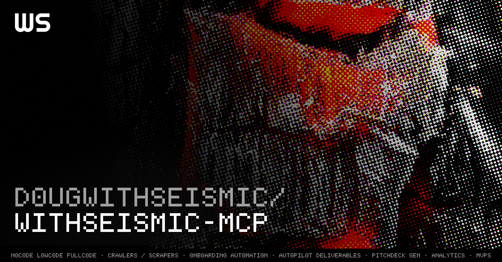

# D0UGWITHSEISMIC/WITHSEISMIC-MCP



```
SYSTEMS ONLINE • NEURAL INTERFACE ACTIVE • COMBAT DATA ANALYSIS • TACTICAL OVERLAY ENABLED • PERFORMANCE METRICS NOMINAL
```

[](https://www.typescriptlang.org/)
[](https://nodejs.org/)
[](https://pnpm.io/)
[](LICENSE)
[](https://discord.gg/BX25FcS53N)
[](https://railway.app/template/RTm6ec?referralCode=dougie)

A production-ready MCP server template for hosting your own AI tools and prompts. Deploy remotely or run locally - built for developers who want to expose their tools to AI models without the infrastructure headaches.

## ://WHO_IS_THIS_FOR?

This template is perfect for:

- **AI Tool Developers**: Build and host your own tools that AI models can interact with
- **Teams & Organizations**: Set up a shared MCP server for your AI applications
- **Individual Developers**: Quick-start your MCP development with a production-ready setup
- **API Providers**: Expose your services to AI models through a standardized interface

Whether you want to:

- 🌐 Host a remote MCP server that multiple clients can connect to
- 🔧 Run locally via stdio for development and testing
- 🚀 Deploy a production-ready MCP implementation
- 🛠️ Build tools without worrying about infrastructure

This template provides everything you need to get started.

## ://OVERVIEW

The MCP server provides two ways to expose your tools to AI models:

1. **Remote Server Mode (SSE)**: Deploy as a remote server that multiple clients can connect to
   - Perfect for production deployments
    (`pnpm start:sse`)
   - Supports multiple simultaneous connections
   - Easy deployment to platforms like Railway
   - Secure and scalable

2. **Local Mode (stdio)**: Run locally for development and testing
 (`pnpm start`)
   - Great for local development
   - Direct stdio communication
   - Fast iteration and debugging

Key Features:

- **Tools**: Executable functions that models can call
- **Prompts**: Template-based message generators
- **Auto-Discovery**: Automatic registration of your components
- **Type Safety**: Full TypeScript support throughout

## ://WHY_USE_THIS_MCP_SERVER_TEMPLATE?

While the Model Context Protocol (MCP) is in its early stages, one thing is clear: **rapid adoption requires frictionless development**. This implementation is built with a singular focus: **letting developers focus on building great tools, not infrastructure**.

### INSTANT_DEPLOYMENT

```bash
# Option 1: One-Click Deploy
Click the "Deploy on Railway" button above ☝️

# Option 2: Local Setup
pnpm install && pnpm dev
```

### ZERO_FRICTION_DEVELOPMENT

- **No Boilerplate**: Define your tool, import it, and you're done. We handle the rest.
- **Auto-Registration**: Tools and prompts are automatically discovered and registered.
- **Type Safety**: Full TypeScript support with zero configuration.

### BATTLE_TESTED_ARCHITECTURE

- **Production Ready**: Built for reliability and performance.
- **Scalable Design**: From simple tools to complex AI interactions.
- **Error Resilient**: Robust error handling and debugging built-in.

### DEVELOPER_EXPERIENCE_FIRST

```typescript
// That's it. This is all you need to create a tool.
export const myTool = new Tool(
  {
    name: "myTool",
    description: "What my tool does",
    inputSchema: z.object({ query: z.string() }),
    outputSchema: z.object({ result: z.string() }),
  },
  async (args) => {
    // Your logic here
    return { result: "Done!" };
  },
);
```

We handle:

- ⚡ Connection management
- 🔄 Tool registration
- 🛡️ Input validation
- 📦 State management
- 🚨 Error handling
- 📊 Logging and metrics

You focus on:

- 🎯 Building amazing tools
- 🧠 Creating powerful prompts
- 🚀 Shipping features

## ://GETTING_STARTED

### INSTALLATION

```bash
pnpm install
```

### RUNNING_THE_SERVER

Two modes are available:

1. Standard mode (stdio):

```bash
pnpm dev      # Development with hot reload
pnpm start    # Production
```

2. SSE (Server-Sent Events) mode:

```bash
pnpm dev:sse  # Development with hot reload
pnpm start:sse # Production
```

When running in SSE mode, connect to: `http://localhost:3001/sse`

## ://CORE_CONCEPTS

### TOOLS

Tools are executable functions that models can invoke. Each tool:

- Has defined input/output schemas using Zod
- Is automatically registered with the registry
- Can perform any operation (calculation, file I/O, API calls, etc.)

Example tool:

```typescript
import { z } from "zod";
import { Tool } from "../core";

const MyToolInputSchema = z.object({
  param1: z.string().describe("Parameter description"),
});

const MyToolOutputSchema = z.object({
  result: z.string().describe("Result description"),
});

export const myTool = new Tool(
  {
    name: "myTool",
    description: "What my tool does",
    inputSchema: MyToolInputSchema,
    outputSchema: MyToolOutputSchema,
  },
  async (args) => {
    const input = MyToolInputSchema.parse(args);
    // Tool logic here
    return { result: "processed result" };
  },
);
```

### PROMPTS

Prompts are message generators that help structure model interactions. Each prompt:

- Defines its argument schema
- Generates messages in a consistent format
- Is automatically registered with the registry

Example prompt:

```typescript
import { Prompt } from "../core";

export const myPrompt = new Prompt(
  {
    name: "myPrompt",
    description: "What my prompt does",
    arguments: [
      {
        name: "arg1",
        description: "Argument description",
        required: true,
      },
    ],
  },
  async (args) => {
    return [
      {
        role: "system",
        content: {
          type: "text",
          text: `Generated message using ${args.arg1}`,
        },
      },
    ];
  },
);
```

## ://ADDING_NEW_COMPONENTS

### Creating a New Tool

1. Create a new file in `src/modules/tools/`
2. Define your input/output schemas using Zod
3. Create and export your tool instance
4. Add the export to `src/modules/tools/index.ts`

The registry will automatically:

- Register your tool
- Make it available to models
- Handle validation and error handling

### Creating a New Prompt

1. Create a new file in `src/modules/prompts/`
2. Define your argument schema
3. Create and export your prompt instance
4. Add the export to `src/modules/prompts/index.ts`

The registry will automatically:

- Register your prompt
- Make it available to models
- Handle message generation and errors

## Architecture

### Core Components

- **Registry**: Central manager for all tools and prompts
- **Tool**: Base class for executable functions
- **Prompt**: Base class for message generators
- **Server**: MCP protocol implementation

### Auto-Registration

The system uses a singleton Registry pattern that:

1. Automatically registers tools and prompts on import
2. Provides type-safe access to components
3. Handles all MCP protocol interactions

### Error Handling

The system includes robust error handling:

- Type validation via Zod schemas
- Execution error wrapping
- Detailed error messages for debugging

## Development

### Type Safety

All components use TypeScript for full type safety:

- Input/output schemas are defined using Zod
- Type inference for tool arguments and results
- Comprehensive error types

### Testing

Run tests using:

```bash
pnpm test
```

### Best Practices

1. Always define clear input/output schemas
2. Use descriptive names and documentation
3. Handle errors gracefully
4. Follow the TypeScript guidelines in the codebase

## ://CONTRIBUTING

```
NEURAL INTERFACE DETECTED • INITIATING COLLABORATION PROTOCOLS • READY FOR UPLINK
```

We welcome contributions! Please see our [Contributing Guide](CONTRIBUTING.md) for details on:

- Development workflow
- Code style guidelines
- Pull request process
- Issue reporting

Join our [Discord community](https://discord.gg/withseismic) to connect with other contributors!

## ://SUPPORT

```
SUPPORT PROTOCOLS ACTIVE • COMMUNICATION CHANNELS OPEN • READY TO ASSIST
```

- 📫 Email: <hello@withseismic.com>
- 💬 Discord: [Join our server](https://discord.gg/BX25FcS53N)

## ://LICENSE

This project is licensed under the MIT License - see the [LICENSE](LICENSE) file for details.

© 2025 Doug, at WithSeismic dot com.
